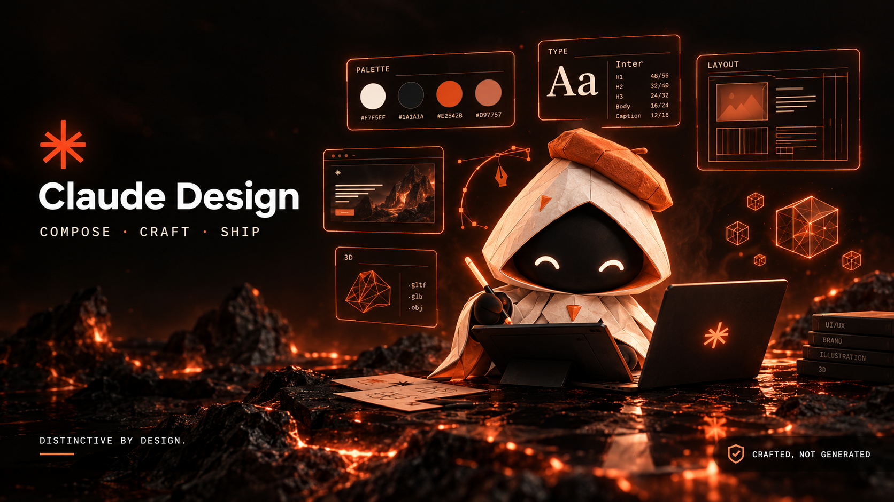
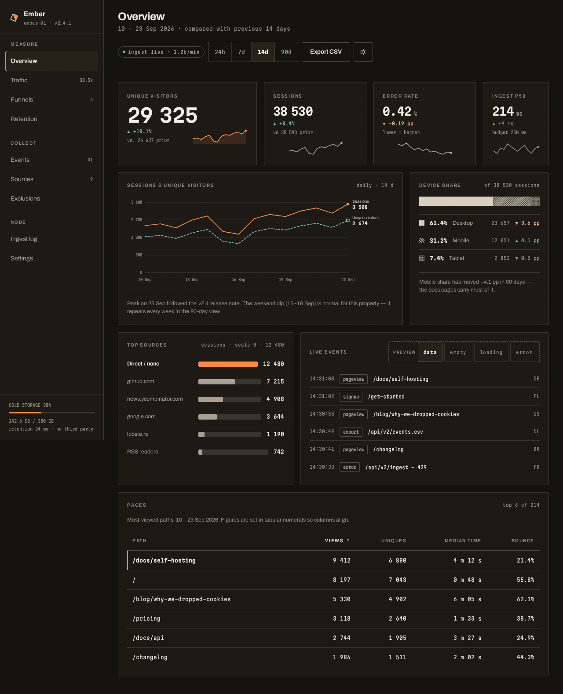
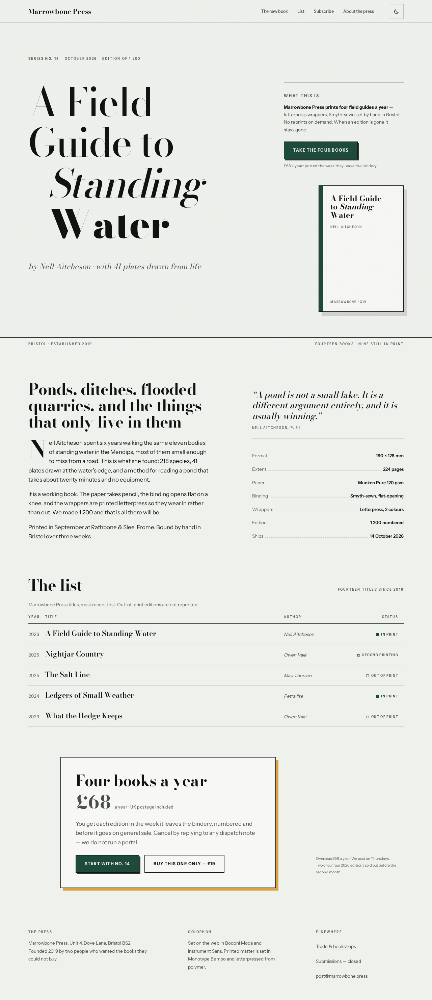

<div align="center">



# Claude Design

**A full-spectrum senior design companion for Claude Code — color, type, layout, UI, motion, 3D, and brand.**
Distinctive by default, not AI-slop. Grounded in real references. Ships real front-end and artifacts.

[](plugins/design)
[](LICENSE)
[](https://code.claude.com/docs/en/plugins)
[](plugins/design/skills)
[](plugins/design/agents)
[](plugins/design/commands)

</div>

---

## Table of contents

- [What is this](#what-is-this)
- [Why it's different](#why-its-different)
- [Showcase](#showcase)
- [Install](#install)
- [The `design` plugin](#the-design-plugin)
- [Quick start](#quick-start)
- [Three ways to use it](#three-ways-to-use-it)
- [Real sources, not made-up trends](#real-sources-not-made-up-trends)
- [Repository structure](#repository-structure)
- [Scope & boundaries](#scope--boundaries)
- [Roadmap](#roadmap)
- [Contributing](#contributing)
- [Contributors](#contributors)
- [License & attribution](#license--attribution)

## What is this

**Claude Design** is a [Claude Code plugin marketplace](https://code.claude.com/docs/en/plugins).
Its **`design`** plugin turns Claude into a **senior design companion** across the
whole craft — and it auto-engages whenever you're working on a website, UI, brand,
color, type, or 3D:

- 🎨 **Foundations** — color systems, typography, layout & composition, design systems, iconography, illustration & imagery
- 🖥️ **Web / UI** — modern web design, real component libraries, responsive, accessibility, UX, landing pages
- ✨ **Motion / 3D** — motion & micro-interactions, web 3D (Three.js/R3F/Spline), 3D assets & shaders, generative/creative coding
- 🧭 **Process** — design research, critique, design-to-artifact, brand identity, handoff, data visualization

It doesn't just talk about design — it **builds it**: real HTML/CSS/React/Tailwind
and self-contained claude.ai artifacts, leaning on real component libraries.

## Why it's different

Most generated design is competent and completely forgettable — the average of
everything, in blue-to-purple gradients. Claude Design is built to be the opposite,
on two principles:

1. **🚫 Distinctive by default (anti-AI-slop).** The core skill checks every
   decision against one question — *intentional and distinctive, or default and
   templated?* It names the tells (blurple gradients, glassmorphism everywhere,
   one-weight Inter, centered-everything, three equal cards, the stock hero→cards→CTA
   skeleton) and drives the moves that defeat them: a point of view, real type,
   intentional color, editorial layout, restraint, warmth over blur. Clean-but-generic
   is the failure mode, not the goal.

2. **📚 Grounded in real references.** It doesn't invent hex values, font names,
   Tailwind classes, or "trends". Decisions are grounded in real curated sources —
   Awwwards, Typewolf, Mobbin, Refero, shadcn, Three.js, GitHub — and real specs
   (WCAG contrast with real numbers, real font metrics, real component APIs).
   Distinctiveness comes from **stealing structure from real work**, not the model's
   average.

3. **🎓 Teaches the eye.** Every skill can explain *why* a choice reads generic vs
   intentional, with a concrete before/after — so you build taste, not just output.

## Showcase

Two pieces built end-to-end by the `design-studio` plugin — deliberately opposite
registers, to show it designs to the brief instead of defaulting to one house style.
Every font is verified against the live Google Fonts registry, every colour pair
passes WCAG (36/36), and both were rendered in light + dark at 1280 and 375px with
the anti-slop pass applied to the actual pixels.

| Ember — self-hosted analytics dashboard | Marrowbone Press — publisher landing |
|---|---|
|  |  |
| *An instrument panel, not a marketing dashboard — hairlines, tabular figures, one hot accent reserved for the live signal.* | *Set like the title page of a book it sells — cold grey-green paper (not cream), Bodoni Moda display.* |

**→ [Browse the full showcase with all screenshots and design notes](examples/README.md)**

## Install

```bash
claude plugin marketplace add unicorn-rm/Claude-Design
claude plugin install design-studio@claude-design
```

Then **start a new Claude Code session** (plugins load at session start).

> The plugin is named **`design-studio`** (its commands are `/design-studio:*`) to avoid a namespace clash with the built-in `design` plugin. The marketplace stays `claude-design`.

```bash
# update
claude plugin marketplace update claude-design && claude plugin install design-studio@claude-design
# remove
claude plugin uninstall design-studio@claude-design
```

> In an interactive session you can also use the `/plugin` menu.

## The `design` plugin

| Area | Contents |
|---|---|
| **Backbone (2)** | `distinctive-design` (anti-AI-slop doctrine), `design-grounding` (real sources + direction schema) |
| **Foundations (6)** | `color-systems`, `typography` *(pairing ref)*, `layout-and-composition`, `design-systems`, `iconography`, `illustration-and-imagery` |
| **Web / UI (6)** | `web-design` *(section-patterns ref)*, `ui-components` *(libraries ref)*, `responsive-design`, `accessibility`, `ux-principles`, `landing-pages` |
| **Motion / 3D (4)** | `motion-and-interaction`, `web-3d` *(Three.js/Spline ref)*, `3d-assets-and-shaders`, `generative-and-creative-coding` |
| **Process (6)** | `design-research` *(sourcing ref)*, `visual-critique`, `design-to-artifact`, `brand-identity`, `dev-handoff`, `data-visualization` |
| **Agents (6)** | `art-director` · `ui-designer` · `design-critic` · `motion-3d-designer` · `brand-designer` · `design-researcher` |
| **Commands (8)** | `/brief` · `/moodboard` · `/critique` · `/palette` · `/typeset` · `/artifact` · `/design-review` · `/handoff` |

**24 skills · 8 deep references · 6 agents · 8 commands.** Every skill that produces
or critiques design honors the two backbone pillars: *is it distinctive* and *is it
grounded in something real*.

## Quick start

```text
# 1. Capture the direction (brand, the one idea, must-avoid, real references)
/design-studio:brief

# 2. Build a distinctive direction from real references
/design-studio:moodboard

# 3. Ground the visual system
/design-studio:palette      # intentional color + real contrast numbers
/design-studio:typeset      # real type pairing + scale

# 4. Ship it as a self-contained artifact
/design-studio:artifact a landing hero

# 5. Or critique / review an existing design
/design-studio:critique <file or url>
/design-studio:design-review <file or url>
```

Or just ask — *"design a hero for a coffee brand"*, *"why does this landing look
AI-made?"*, *"pair fonts for an editorial site"*, *"add a Three.js product scene"*,
*"make this accessible"* — the plugin engages on its own.

## Three ways to use it

- **Companion** — reviews and improves your design in place, names the tells, fixes them.
- **Autonomous artifacts** — produces shippable deliverables: HTML/React pages, claude.ai artifacts, palettes, type systems, tokens, moodboards.
- **Mentor** — explains *why* a choice reads intentional vs generic, so you build the eye.

## Real sources, not made-up trends

`design-grounding` ships a curated registry across color (Coolors, Adobe Color,
Radix, uicolors, Happy Hues), type (Google/Adobe Fonts, Typewolf, Fontpair,
Fontshare), inspiration (Awwwards, Land-book, Mobbin, Refero, SiteInspire, Godly),
components (shadcn, Radix, Tailwind, Aceternity, Magic UI, HyperUI, Flowbite,
Tremor), 3D/graphics (Three.js/R3F, Spline, Sketchfab, poly.pizza, Poly Haven,
Rive, Lottie), icons (Lucide, Phosphor, Iconify) — and **GitHub as a first-class
source of real component code**. Public pages are fetched, APIs are used where they
exist, real code is read from GitHub, and login-gated sources are used as named
references — never fabricated.

## Repository structure

```
Claude-Design/
├── .claude-plugin/marketplace.json     # marketplace manifest (name: claude-design)
├── plugins/design/
│   ├── .claude-plugin/plugin.json
│   ├── skills/                         # 24 skills (+ 8 deep references)
│   ├── agents/                         # 6 senior personas
│   ├── commands/                       # 8 workflows
│   ├── evals/                          # `claude plugin eval` suite (5 cases)
│   └── README.md · NOTICE.md
├── tools/validate_plugin.py            # structural validator (backbone contract)
├── docs/                               # design spec
├── CHANGELOG.md · CONTRIBUTING.md · CONTRIBUTORS.md · SECURITY.md · LICENSE
```

## Scope & boundaries

Claude Design owns the design craft and ships it as real front-end + artifacts. It
**bridges** rather than duplicates: full application engineering goes to a future
`dev`/`frontend` plugin; deployment to [Claude DevOps](https://github.com/unicorn-rm/Claude-DevOps);
deep security to [Claude Cyber](https://github.com/unicorn-rm/Claude-cyber). It
orchestrates real libraries (Three.js, GSAP, shadcn) rather than reinventing them.

## Roadmap

- [ ] More deep references (color recipes, easing library, brand systems)
- [ ] Provider/tool-specific artifact templates
- [ ] More `claude plugin eval` coverage
- [ ] Additional plugins in the Claude IT Plugins line

## Contributing

Contributions welcome — see [CONTRIBUTING.md](CONTRIBUTING.md). In short: keep the
contract (distinctive + grounded), run `python3 tools/validate_plugin.py` (must be
green), and add/extend evals for behavior changes.

## Contributors

- **[unicorn-rm](https://github.com/unicorn-rm)** — author & maintainer
- **Claude (Claude Code, Anthropic)** — AI pair-developer

See [CONTRIBUTORS.md](CONTRIBUTORS.md).

## License & attribution

[MIT](LICENSE) © 2026 unicorn-rm. Methodology content is original; it points to real,
curated external sources (which belong to their owners) and grounds design decisions
in them at use time rather than fabricating specifics — see
[plugins/design/NOTICE.md](plugins/design/NOTICE.md).

<div align="center"><sub>Built with Claude Code · design with a point of view.</sub></div>
