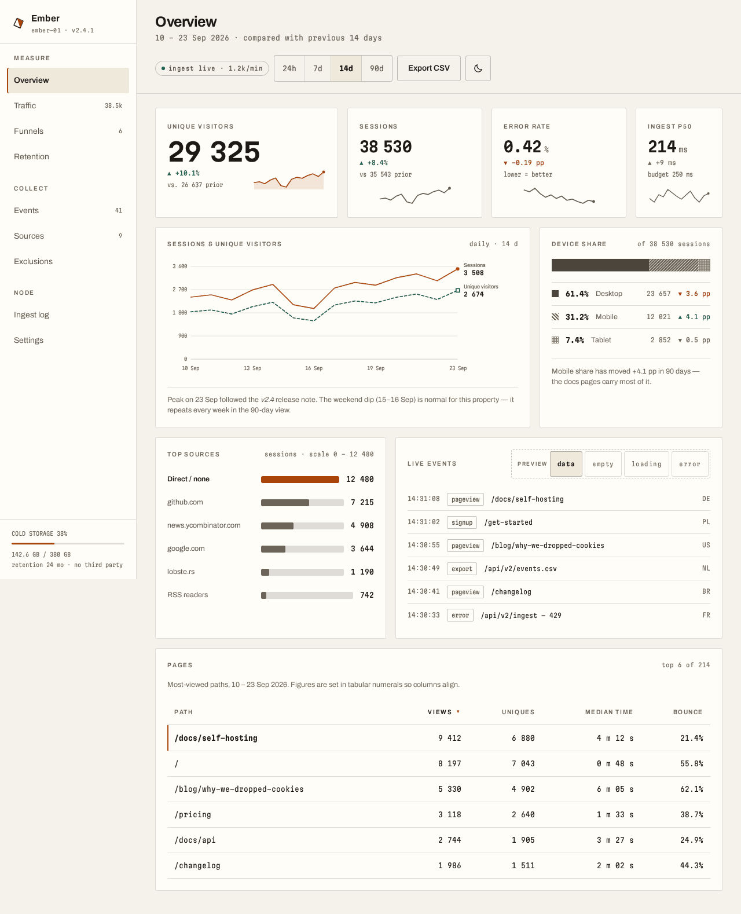
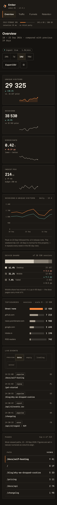
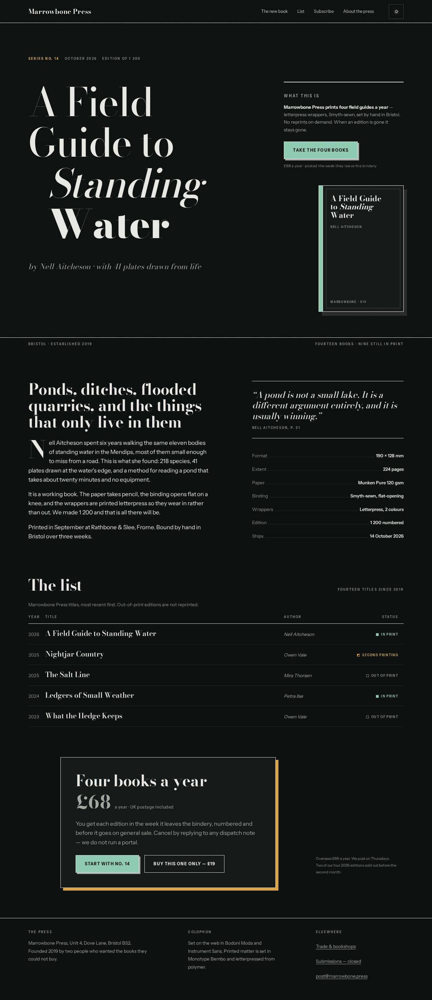
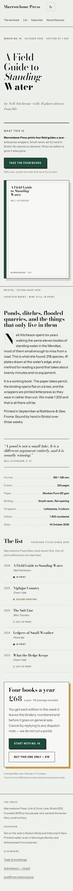

# Claude Design — Showcase

Two finished pieces, built with the `design-studio` plugin. They exist to answer one
question: **does the plugin pick an aesthetic for the brief, or does it have a house
style it applies to everything?**

So the two briefs were chosen to pull in opposite directions, and the results are
meant to look like they came from two different studios. Each is a single
self-contained `index.html` — no build step, no framework, no component library.
Open the file.

| | [Ember](#1--ember--self-hosted-analytics-console) | [Marrowbone Press](#2--marrowbone-press--landing-for-an-independent-press) |
|---|---|---|
| **Register** | technical, dark-first, instrument panel | editorial, light-first, letterpress |
| **Type** | Archivo + Martian Mono | Bodoni Moda + Instrument Sans |
| **Accent** | ember `#FF8A3D` | bottle green `#1C4B3C` |
| **Corners** | 3 px | 0 — square, always |
| **Depth from** | hairlines, a lit top edge, grain | hard register shadows, rules, paper grain |
| **Motion** | state transitions only | one staged reveal on load |
| **Skills leaned on** | `data-visualization`, `design-systems`, `layout-and-composition` | `landing-pages`, `typography`, `motion-and-interaction` |

---

## 1 · Ember — self-hosted analytics console

> **One idea:** it's an instrument panel, not a marketing dashboard — hairlines, tabular
> figures and one hot accent reserved for the live signal.

[`ember-dashboard/index.html`](ember-dashboard/index.html)

**Type** — [Archivo](https://fonts.google.com/specimen/Archivo) (variable, `wght 100–900`,
`wdth 62–125`) carries the UI; the `wdth` axis condenses table headers and nav labels
instead of shrinking them. [Martian Mono](https://fonts.google.com/specimen/Martian+Mono)
(variable, `wght 100–800`, `wdth 75–112.5`) sets every figure, so all numerals are
tabular by construction. Both axis ranges verified against the live Google Fonts
registry, not remembered.

**Palette + contrast** (WCAG 2.x, computed — AA needs 4.5:1 for text, 3:1 for graphics):

| Role | Dark | Ratio | Light | Ratio |
|---|---|---|---|---|
| page / panel | `#14120F` / `#1C1915` | — | `#F5F2EC` / `#FFFDF8` | — |
| body text | `#F2EDE3` | **15.01:1** | `#1B1815` | **15.82:1** |
| secondary | `#A8A094` | **6.77:1** | `#5E574C` | **6.38:1** |
| axis + tertiary | `#948C7F` | **5.27:1** | `#6B6357` | **5.30:1** |
| accent | `#FF8A3D` | **7.47:1** | `#A8440A` | **5.38:1** |
| ink on accent fill | `#14120F` | **7.97:1** | `#FFFDF8` | **5.91:1** |
| trend series 1 / 2 | `#FF8A3D` `#5CC8C2` | 7.47 / 8.75 | `#B24A0B` `#0E5F5A` | 5.33 / 7.37 |
| part-to-whole ramp | `#D8CFC0` `#A79E90` `#7E766A` | 11.35 / 6.62 / 3.91 | `#4A443B` `#6B6357` `#8A7F6C` | 9.47 / 5.82 / 3.87 |

Dark is the base palette on `:root`; light is a **second designed palette**, not an
inversion — the accent drops from `#FF8A3D` to `#A8440A` so it stops glowing, and the
series are re-picked for a light ground.

**What's in it** — sidebar nav with a lit rail on the current item; an intentionally
**unequal** KPI strip (the headline metric spans twice the width of its neighbours, and
keeps a side-by-side foot while the others stack); three charts chosen per question —
line for trend, horizontal bars for category comparison, 100 % stacked bar for
part-to-whole (never a pie); a table set in tabular numerals with `aria-sort`; and the
empty / loading / error states, switchable in place through a real radio group and CSS
`:has()`.

**Data-viz rules actually applied** — every value axis starts at zero and says so;
the second series is **dashed with a square end-marker**, and the three parts of the
stacked bar are **solid / hatched / dotted**, so nothing is carried by hue alone; both
lines are labelled at their ends, and the legend was deleted once the direct labels
made it redundant; each chart states its own scale (`scale 0 – 12 480`,
`of 38 530 sessions`). **The accent means exactly one thing** — "the primary series,
the leading row" — so part-to-whole gets its own neutral ramp rather than borrowing the
series hues and making orange mean "Sessions", "Desktop" and "the leader" in one view. At 375 px the 14-day chart gets a focusable scroll region
rather than being crushed to half size.

<strong>Why this doesn't read as AI</strong>

- **No `backdrop-filter`, anywhere.** Depth is a 1 px lit top edge (`inset 0 1px 0`),
  hairline borders expressed as *ink at alpha* rather than grey, and a real grain
  overlay. No glassmorphism, no soft grey drop-shadows on cards.
- **Not four equal cards.** The KPI row is 4 + 3 + 3 + 2 columns, and the panels below
  run 8 + 4 then 5 + 7. Nothing in the layout is centred.
- **No blurple.** The accent is a specific ember orange; the whole ground is a *warm*
  near-black (`#14120F`), not the default blue-black.
- **Not Inter-on-everything.** Two families doing two jobs, with the width axis used as
  a real design tool.
- **3 px radius, not `rounded-2xl`.** Instrument panels have tight corners.
- **The numbers were typeset, not just printed.** Martian Mono gives every space a full
  advance, so `29 325` split into two numbers at display size — corrected with
  `word-spacing: -.34em` on the KPI figure only.
- **Motion means something.** There is no fade-up-on-scroll. The only animation is the
  loading skeleton's sweep, and it is removed under `prefers-reduced-motion`.

---

## 2 · Marrowbone Press — landing for an independent press

> **One idea:** the page is set like the title page of the book it sells.

[`marrowbone-landing/index.html`](marrowbone-landing/index.html)

**Type** — [Bodoni Moda](https://fonts.google.com/specimen/Bodoni+Moda) (variable,
`wght 400–900`, `opsz 6–96`) set at `opsz 96` for the display and `opsz 18–44` for
smaller settings, so the hairlines thin out at size the way a didone should. Body and
marginalia in [Instrument Sans](https://fonts.google.com/specimen/Instrument+Sans)
(variable, `wght 400–700`, `wdth 75–100`). Both families **start at 400** — neither has a
light weight, which is exactly the kind of detail that gets invented; it was checked
against the registry first.

**Palette + contrast:**

| Role | Light | Ratio | Dark | Ratio |
|---|---|---|---|---|
| paper / card | `#EFF1ED` / `#F7F8F5` | — | `#0D110F` / `#141A17` | — |
| body text | `#101311` | **16.45:1** | `#E7E8E2` | **15.43:1** |
| secondary | `#4A514B` | **7.19:1** | `#A2A79F` | **7.76:1** |
| tertiary | `#5E6660` | **5.21:1** | `#8B918A` | **5.90:1** |
| accent | bottle green `#1C4B3C` | **8.71:1** | sage `#8ECBB0` | **10.25:1** |
| on accent fill | `#EFF1ED` | **8.71:1** | `#0D110F` | **10.25:1** |
| ochre highlight | `#7A5310` text | **6.01:1** | `#D9A441` | **8.46:1** |

The paper is a **cool grey-green**, deliberately not cream. Dark isn't an inversion
either: the ground becomes a pressroom at night, and the bottle green has to lift to
sage to survive on it — the ochre is the one colour that carries in both.

**What's in it** — an asymmetric hero where the display type takes columns 1–8 and a
continuous right rail carries the marginalia, the single CTA, and the cover, drawn in
CSS; a title-page indent on the second display line; a two-column spread with a drop cap,
a margin pull-quote, and a spec list with dotted leaders; the backlist as a **publisher's
list** rather than three feature cards; and one offer block, deliberately off-centre.

**The one motion** — on load the masthead rule *draws* left-to-right, then the type
lands in sequence (kicker → line 1 → line 2 → byline → rail → cover) on a single easing,
`cubic-bezier(.16,.84,.28,1)`, reused by every hover in the page. It reveals the
structure of a title page rather than decorating it. Under `prefers-reduced-motion:
reduce` it is off and everything renders at rest — verified: 0 running animations,
opacity 1.

<strong>Why this doesn't read as AI</strong>

- **No `backdrop-filter`, no gradient.** Depth is a **hard offset register shadow**
  (`box-shadow: 4px 4px 0`) — the print register, not a soft blur — plus rules and grain.
- **Zero border-radius.** Every corner is square, on purpose, including the buttons.
- **Not the stock skeleton.** There is no hero → 3 cards → testimonial → pricing → CTA.
  It runs masthead → title page → spread → list → one offer → colophon.
- **Not cream + serif + terracotta.** That combination is itself an AI default now. This
  is cool grey-green paper, a didone, and bottle green.
- **Real type contrast** — a ~7 rem display against 17 px body, with an italic inside the
  headline and optical sizing actually driven, not decorative.
- **Status is never colour alone.** "In print" / "Second printing" / "Out of print" each
  get a filled, half-filled or empty square *and* the words.
- **It recomposes on a phone rather than scrolling away.** The backlist table becomes
  stacked rows under 680 px; nothing is squeezed.

---

## What was actually verified

Not "should be fine" — each piece was rendered in headless Chromium and checked:

- **Both themes at 1280 px and at 375 px** — the six screenshots above are that render.
- **19 viewport widths × 2 themes × 2 pages — 76 configurations**, from 1600 px down to
  320 px: zero horizontal scroll everywhere, and zero elements escaping the viewport
  outside a deliberate `overflow-x` region (the Ember chart and table), each of which is
  focusable and labelled.
- **Contrast** — 36 foreground/background pairs across all four themes computed against
  the WCAG formula. **0 failures.** The numbers in the tables above are those results.
- **Fonts** — all four families, their weight ranges and variable axes confirmed against
  `fonts.google.com/metadata/fonts`, and the CSS2 URLs confirmed to resolve with the
  requested ranges. 7 and 6 faces loaded respectively at render time.
- **Keyboard and structure** — skip link, visible `:focus-visible` ring on every
  interactive element, heading levels in order with no skipped level, one `h1` per page,
  and every interactive target ≥ 44 px.
- **Theme without any override** — under `prefers-color-scheme` alone, both pages pick
  the right palette, and the toggle round-trips with the icon showing the *action* rather
  than the current state.
- **State switching** — Ember's empty / loading / error / data panels confirmed to swap.
- **Reduced motion** — 0 running animations and full opacity under
  `prefers-reduced-motion: reduce`.

Both pieces were then put through the plugin's own `design-critic` agent against the
rendered screenshots. Everything it raised was fixed: the display leading (`.92`) could
not clear a Bodoni italic descender, so *Standing* / **Water** collided in the hero —
now `1.04`; Ember's mobile nav scroller had no edge affordance and its node/retention
facts were `display:none`-d rather than reflowed; the accent hue carried three different
meanings in one viewport; and the state switcher looked like product chrome instead of a
preview control. Its verdict on the brief's central question: *"genuinely two"* —
different type logic, grid systems, shadow language and content genre, not one design
palette-swapped.

Fixes found *by looking at the render* and corrected in code: a storage meter that
rendered as a solid orange square (height on an inline element), an accent rule painting
between every cell of a table row, KPI notes wrapping to three lines, chart labels
colliding at phone width, and an `overflow-x: hidden` that was making the page's own
overflow test pass falsely. The best of them: the theme toggle's icon never changed,
because `element.hidden = true` is an `HTMLElement` property — assigning it on an **SVG**
element sets a JS expando and reflects no attribute at all. Only clicking the rendered
button exposed that.

## Notes

- Fonts load from Google Fonts over the network; both files carry real fallback stacks
  and `font-display: swap`, so they degrade legibly offline.
- The products, people, figures and quotes are invented. The type, the colour values, the
  contrast ratios and the chart arithmetic are not.

---

*Built by the `design-studio` plugin.*
